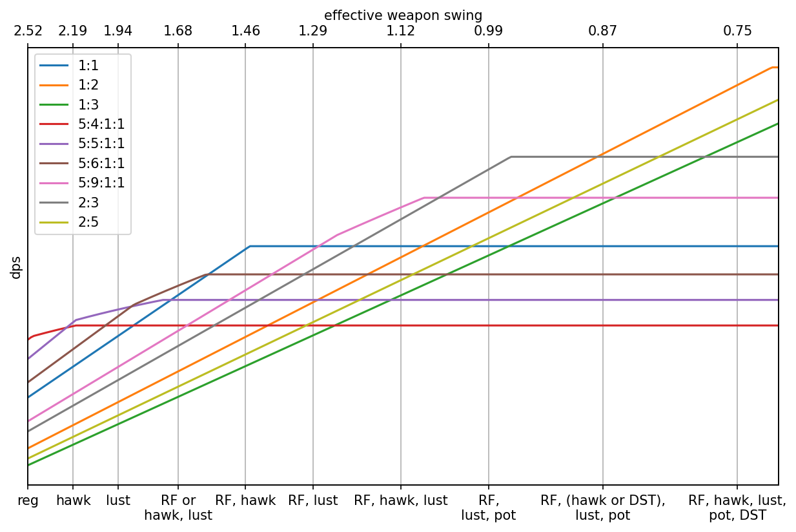
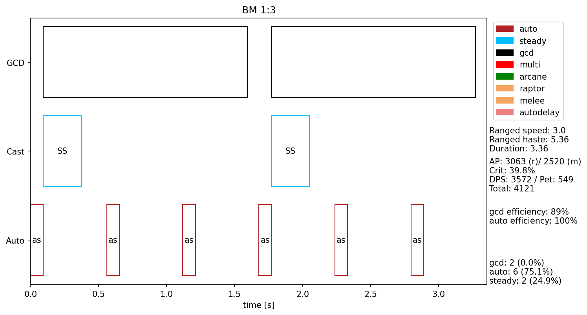
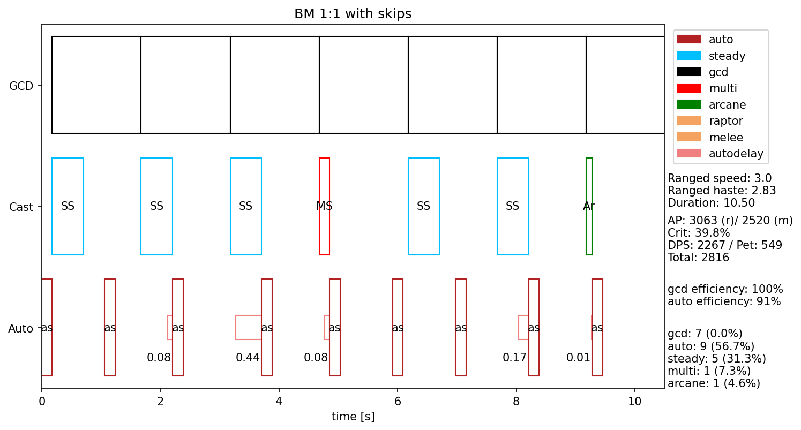
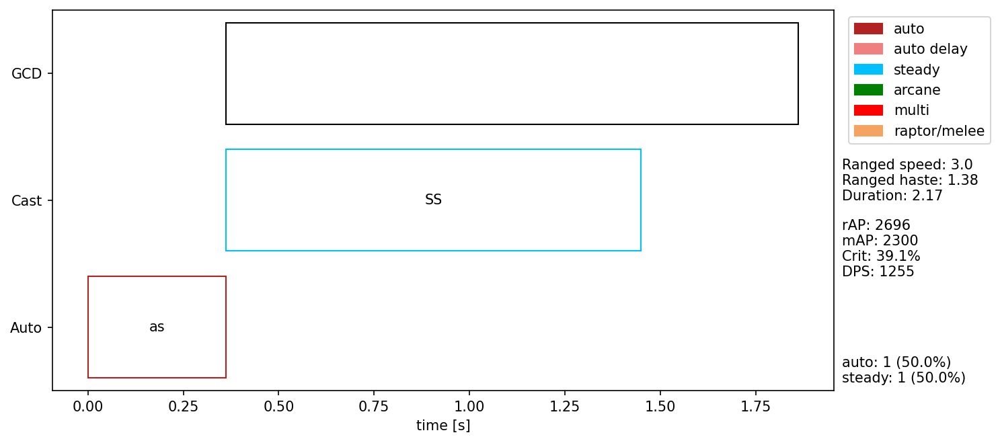

# TBC Hunter rotation overview

### Contents

- [Hunter rotations and haste](#hunter-rotations-and-haste)
- [Rotation details](#rotation-details)
- [Melee weaving](#melee-weaving)
- [Gear used](#gear-used)
- [Library usage](#library-usage)

## Hunter rotations and haste

In TBC, hunters will be running different rotations based on their current haste level or effective weapon swing. There are different concepts to visualize this: While the most frequently encountered notation is that of effective weapon swing (eWS) which can also be observed intuitively, using the total haste can be advantageous in some situations.

### Static haste

In early TBC, there will be no static haste on gear. Our only source for haste are 15% from quiver and possibly 20% from the BM talent Serpent's Swiftness. Thus, survival hunters start at 15% total haste, which means that they get 15% additional attack during a particular time. Their eWS is

```
eWS = WS / 1.15
```

as this is how haste is applied in World of Warcraft.

For BM hunters, the two sources of haste apply multiplicatively, so their eWS is

```
eWS = WS / 1.15 / 1.2 = WS / 1.38
```

In both cases, `WS` is the original weapon swing time as given in the weapons tooltip.

In most of TBC, hunters will be using weapons with 3.0 tooltip speed. The only exception is P1, where the best weapon (Sunfury Bow of the Phoenix off of Prince Malchezaar) has a 2.9 speed. The best preraid weapon, Wrathtide Longbow, also has a 3.0 speed as most later weapons.

### Changing rotations

During a fight, TBC hunters use different rotations depending on their current haste value or effective weapon swing. Stacking all available haste effects, hunter can achieve 3.36 additional haste for a total of 4.64 with BM talents. This pushes the eWS down to 0.62 seconds. This relies on having improved Aspect of the Hawk and the proc of Dragon Spine Trophy up during your own stacked haste effects from Bloodlust, Rapid Fire, Drums of Battle and Haste Potion. This can only happen for a maximum of 10 seconds (shortest duration of these effects) every 10 minutes (longest cd of these effects), but we will be doing huge dps during this time.

Most of the time, we will have much lower haste. This is okay, we can still do top notch dps without this excessive stacking.

#### BM rotations over haste

Here is an overview of available rotations - which will be explained further on - and their relative dps at different haste levels:


Drums of battle are only included when a haste potion is used to illustrate the highest levels of haste achievable in phase 1. When using drums of battle at all times in our group, all of the lower haste points move slightly to the right, increasing our dps. This does not change the rotation we should use at any of these common haste points.

#### SV rotations over haste

For survival hunters, the graph looks slightly different due to lower base haste, and as a result the effective weapon swing is always slower:



Depending on the phase and current gear, as a survival hunter we may or may not be specced into improved aspect of the hawk, thus this effect may not apply at all.

## Rotation details

### Basic rotations

All basic rotations use only steady shot for illustration purposes, but in practice should use multi shot instead of a steady shot whenever it is off CD to slightly improve dps.

#### 2:1

Casting two steady shots and one auto shot alternatingly. This is lower dps than the complex rotation for any level of haste, and shouldn't be used. Ever.

Because we don't use, we don't have to draw it either.

#### 1:1


This is the most simple rotation possible and can be achieved by using a macro of the form

```
/castsequence !Auto shot, Steady shot
```

This rotation is used at effective weapon swings from 1.3 to 1.6 seconds, where the GCD and auto shot swing line up almost exactly.

#### 1:2


At high enough haste, we can let two auto shots through during the GCD of one steady shot.

#### 1:3



At even more haste, we can let a third auto shot through between casting steadies. Sadly, these levels are out of reach an phase 1, and can only be reached with static haste gear in later phases.

### Complex rotations

#### The short French rotation (5:4:1:1)


This only ever appears for survival hunters without the 20% haste out of the BM talent tree.

#### The French rotation (5:5:1:1)


The standard rotation for BM hunters and survival hunter with improved Aspect of the Hawk or DST procs active. Compared to the 1:1 rotation, it slightly delays the auto shots to fit additional shots in. The additional shots are only multi and arcane shots due to their lower cast time.

#### The long French rotation (5:6:1:1)


A slight dps increase over the standard French rotation with Aspect of the Hawk proc for BM hunters is using multi and arcane together to fit just one additional shot in between your autos, instead of the two additional shot of the standard French rotation.

#### The skipping rotation (5:9:1:1)



This is a variant of the 1:1 rotation that uses the shorter cast time of multi and arcane shot to let another auto shot through with each of these casts, resulting in 7 casts for every 9 auto shots. This is used for BM hunters with Rapid fire and Hawk proc or Rapid fire and Bloodlust up (shown here).

### Combined rotations

Like the basic rotations, the illustrations here use only steady shots, that should be replaced with multi shots whenever possible.

#### 2:3


This rotation alternates cycles of 1:1 and 1:2 to better match GCD and weapon swing.

#### 2:5


This combines cycles of 1:2 and 1:3 at very high haste - for phase 1, this requires having improved Aspect of the Hawk *and* DST procs during Bloodlust, Rapid fire, drums and haste potion.

## Melee weaving

Although it appears like we have less time at high levels of haste, weaving actually because easier in TBC mostly due to the removal of the deadzone. When positioned at minimal shooting range all it takes is the tiniest of steps to get into melee range - weaves can be done as quickly as 0.2 seconds for stepping in, using Raptor strike or a melee white hit, and stepping out again. Depending on habit, backpedaling can be a viable mode of movement here because the distance to travel is just so low. Even slow weavers will manage to stay below 0.4 seconds weaving time, so at even at all extremely stacked haste it does not interfere with auto shots.

Rotations for melee weaving will be added here soon, there will most likely be fewer different rotations when weaving.

## Gear used

The rotations and dps numbers presented here are based on optimal gear for phase 1, with the slight change that all sets use two-handed weapons to enable melee weaving. For fights where it is impossible to weave at all, this may be a slight disadvantage due to the fact that fist weapons can use weightstones that give melee and ranged critical strike rating, whereas all reasonable two-handed weapons can only use sharpening stones that give only melee critical strike rating. All sharpening and weightstones also increase weapon damage for melee and ranged combat, although weapon damage does not increase steady shot damage. Obviosly, with two-handed weapons we can also only use one of these stones, whereas with two one-handed weapons we can use two such stones.

### The sets and their stats

- [BM P1 BiS set](https://seventyupgrades.com/set/4dB2vLVYvjV8BENUcoNNdx)
  - Raw stats: 1823 AP (607 Agi), 21.48% Crit, 6.09% Hit 
  - With talents & buffs & debuffs: 3063 AP, 39.79% Crit, hitcapped
- [SV P1 BiS set](https://seventyupgrades.com/set/bnmrrPa2anXUKAhDgNgR8j)
  - Raw stats: 1866 AP (690 Agi), 19.12% Crit, 3.61% Hit
  - With talents & buffs & debuffs: 3375 AP, 44.33% Crit, hitcapped
  - Fully buffed this set has 1101 agility for a bonus of 275 AP from Expose weakness

There is also an [overview of buffs and debuffs](buffs) that we can expect in a raid environment.

### Acknowledgement

This overview would have been impossible to complete without others, especially on the [Classic & TBC Hunter Discord](https://discord.gg/8TVHxRr). In no particular order, thanks go out to Aegeagh, Chitzen, Kanja, Tragnar, BradBlondeBeard, Veramos, Ocisly, Wdwune, and Bouk who has gone missing recently. This applies to this guide and the library as well.

### Resources

- [Bouk's rotation guide](https://boukx.github.io/rotations/)
- [Kanja's TBC Hunter guide (French)](https://chasseur-bc.jimdofree.com/), the reason it is called the "French" rotation
- [BradBlondeBeard's Burning Book of pet damage taken](https://docs.google.com/spreadsheets/d/1p7vucH8lt0Gjyz-Q75sILextXvu5ZRKt-nZ_MK7e7dE) - can also be used as a guideline of where to weave
- [Veramos' gear comparison sheet](https://docs.google.com/spreadsheets/d/17z2w8rrc_nW4TqLkxy0VzHLpkbCcYGtQFGBV3_8FZjs)
- [Veramos' gearing video](https://www.youtube.com/watch?v=RVdBciAUknc) - there are more than just this one

# Library usage

An instance of the `rotationplot` class has the function `add_rotation()` that accepts strings in the shot notation format defined below. The object will then calculate the duration and damage of this rotation based on current damage stats and current haste. Currently, it does not handle any proc effects, but Improved Aspect of the Hawk procs can be added manually. They do currently not expire.

For an object that has an initialized rotation, `calc_dps()` can be called and returns the dps for this rotation. Also, `calc_dur()` is available and return the duration of this rotation given current haste values. Upon changing haste, `recalc()` can be called to recalculate for different haste and damage stats, but keeping the rotation as is.

For generating rotation plots, `init_fig()` must be called beforehand. Alternatively, `recalc()` can be used after initializing the figure. After either supplying a rotation or calling `recalc()`, `complete_fig()` can be called to add labels and thus finalize the plot.

### Shot notation

- `a` for auto shot
- `s` for steady shot
- `m` for multi shot
- `A` for arcane shot
- `r` for raptor strike
- `w` for melee white hits
- `h` manual Improved Aspect of the Hawk proc

## Usage examples

```python
import rotationtools
r = rotationtools.rotationplot()
r.init_fig()
r.add_rotation('as')
r.complete_fig()
```

This will create the 1:1 rotation example shown below.



Simple 1:1 rotation.

```python
import rotationtools
r = rotationtools.rotationplot()
r.init_fig()
r.add_rotation('asmasasAasas')
r.complete_fig()
```


French rotation (5:5:1:1)

### To run locally
- Install python3
- Install depencencies

```
pip3 install matplotlib
```
